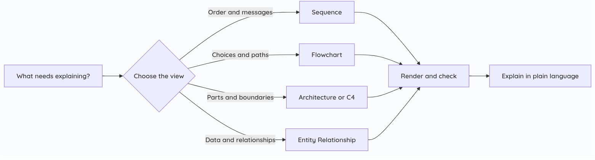

# Mermaid Diagramming for Agents

**Help your agent explain its intent with the right diagram.** This skill chooses a Mermaid diagram for the question, writes a focused visual, explains what it means, and checks that it renders. It also includes a searchable help catalog for **34 diagram types**.



## Why use it?

A useful diagram makes a relationship visible: who talks to whom, what happens next, which states are allowed, how components fit, or how quantities compare. The skill picks among 34 Mermaid types rather than defaulting to a flowchart. It keeps diagrams small, distinguishes known facts from assumptions, and asks the agent to render every diagram before delivery.

| Intent | Good first choice |
| --- | --- |
| Show decisions or a procedure | Flowchart |
| Show messages in time order | Sequence |
| Show system boundaries | C4 or Architecture |
| Show database relationships | Entity Relationship |
| Show one object's lifecycle | State |
| Show a schedule or business timeline | Gantt, Timeline, or Event Modeling |
| Show hierarchy or ideas | TreeView, Mindmap, or Treemap |
| Show grammar | Railroad (ABNF, EBNF, PEG, or IR) |

The full catalog includes Flowchart, Class, Sequence, Entity Relationship, State, Mindmap, Architecture, Block, C4, Cynefin Framework, Event Modeling, Gantt, Git, Ishikawa, Kanban, Packet, Pie, Quadrant, Radar, four Railroad forms, Requirement, Sankey, Timeline, TreeView, Treemap, Use Case, User Journey, Venn, Wardley Maps, XY, and ZenUML.

## Install

After this repository is public on GitHub, replace `YOUR_GITHUB_NAME` with your GitHub username or organization:

```sh
npx skills add MaidenAl/mermaid-diagramming-skill --skill mermaid-diagramming
```

For a manual project install, copy `skills/mermaid-diagramming/` into your project's `.agents/skills/` directory. The folder name must stay `mermaid-diagramming`. The skill follows the [Agent Skills format](https://agentskills.io/specification).

The help command needs Python 3. To render diagrams, install [Mermaid CLI](https://github.com/mermaid-js/mermaid-cli):

```sh
npm install -g @mermaid-js/mermaid-cli
mmdc --version
```

Mermaid CLI needs a browser for rendering. See its documentation if your environment cannot launch one. `mmcli` on some systems is an unrelated ModemManager command; this skill uses `mmdc` for Mermaid.

## Use

Ask your agent: “Show the request flow as a diagram,” “Choose a diagram to explain the service boundaries,” or “Use `$mermaid-diagramming help` to show the available types.” For a specific type, ask “`$mermaid-diagramming help Sankey`.”

You can query the catalog yourself from the repository root:

```sh
python3 skills/mermaid-diagramming/scripts/help.py
python3 skills/mermaid-diagramming/scripts/help.py help "Railroad (PEG)"
python3 skills/mermaid-diagramming/scripts/help.py all
```

Each detail result says **what** the diagram shows, **when** to use it, **how** to start, and links to Mermaid's syntax page. The skill's reference files give extra guidance for common diagram types. Rendering checks syntax and browser compatibility; you still need to review the meaning against your source material.

## Verify a diagram

```sh
mmdc -i diagram.mmd -o diagram.svg
```

For Markdown with multiple Mermaid fences, use `mmdc -i document.md -o /tmp/document.md`. If the installed Mermaid version does not support a newer diagram type, keep the requested type and report the limitation. See the [Mermaid syntax index](https://mermaid.js.org/intro/syntax-reference.html) for current type support.

## Publish and get listed

Follow [PUBLISHING.md](PUBLISHING.md) for the GitHub steps and the current submission route for [AgenticSkills](https://agenticskills.io/skills). A directory listing is curated; submitting does not guarantee acceptance or traffic.

## License and credit

MIT. See [LICENSE](LICENSE).
