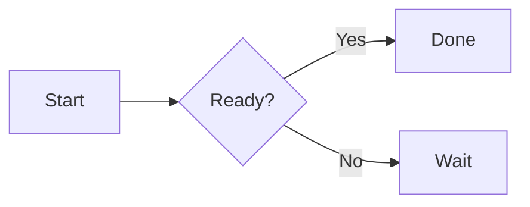
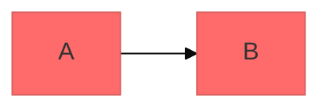

# Mermaid diagramming

Create text-based Mermaid diagrams that can be kept with source and updated as the system changes. Use a diagram when relationships, order, hierarchy, quantities, choices, or change over time would be clearer visually. This applies even when the user did not explicitly ask for a diagram. Choose the type that expresses the actual question; do not force a diagram into a simple fact or use several types where one focused view is enough. If two distinct views are needed, explain what each adds.

## Core syntax

Most diagrams begin with an exact type declaration, followed by its definitions. YAML frontmatter, when used, comes before that declaration. Mermaid uses `%%` for line comments. Unknown syntax can break rendering; misspelled configuration parameters may be ignored without warning.



Start with the few parts needed to answer the question, use clear labels, and split a crowded diagram into focused views. Add a comment only when a non-obvious constraint or relationship needs explanation. Do not narrate every node. When the result belongs to project documentation, keep the Mermaid source with that documentation so it can be revised.

## Choose a type

The [diagram catalog](references/diagram-types.json) covers 34 diagram types. Query it before choosing an unfamiliar type or when two types seem similar. Run these commands from the directory containing this `SKILL.md`, or resolve `scripts/help.py` relative to that directory:

```text
python3 scripts/help.py
python3 scripts/help.py help "Railroad (PEG)"
```

For a user request such as `$mermaid-diagramming help` or `$mermaid-diagramming help <type>`, run the same command and explain its result in plain language. `help.py all` prints the full what, when, how, and starter syntax for every type. Names, aliases, and declaration keywords are accepted for a single-type query.

Some close choices need care:

- Use **Sequence** for messages over time; **ZenUML** when nested calls and return structure are the point; **Event Modeling** when commands, events, and views form a business timeline.
- Use **Flowchart** for decisions and paths; **State** for the allowed states of one thing and its transitions; **User Journey** for a person's steps and experience.
- Use **Class** for object structure; **Entity Relationship** for stored entities and cardinality; **C4** for software system levels; **Architecture** for deployed services and connections; **Block** for a compact arrangement of parts.
- Use **Mindmap** for ideas branching from a center; **TreeView** for a directory-like hierarchy; **Treemap** for hierarchical quantities.
- Use **Railroad** only for a grammar. Match the notation in the source: **ABNF**, **EBNF**, or **PEG**. Use **IR** for direct control of railroad primitives.

The catalog gives a small starting example and a link to Mermaid's own syntax page for every type. Read that page for nontrivial syntax or features. Keep claimed facts and inferred relationships distinct in the finished diagram.

## Local detail guides

Read only the guide for the type or feature being made:

- [Flowcharts](references/flowcharts.md): decisions, paths, subgraphs, node shapes, and links.
- [Sequence diagrams](references/sequence-diagrams.md): participants, messages, conditions, loops, and notes.
- [Class diagrams](references/class-diagrams.md): members, inheritance, composition, and multiplicity.
- [Entity relationship diagrams](references/erd-diagrams.md): entities, attributes, keys, and cardinality.
- [C4 diagrams](references/c4-diagrams.md): context, containers, components, and boundaries.
- [Architecture diagrams](references/architecture-diagrams.md): services, groups, icons, and connections.
- [Advanced features](references/advanced-features.md): themes, layout, styling, accessibility, and export.

These guides include worked examples for the common types. For the remaining types, use the local catalog's starter and its type-specific official syntax link.

## Configuration and export

Use frontmatter when a supported diagram needs a theme, layout, or look. Check the diagram's syntax page because support varies by type. For example:



Export with `mmdc -i diagram.mmd -o diagram.svg` (or `.png` or `.pdf`). Keep a text description or labels that make the meaning understandable without relying only on color. Prefer a title or short explanation when the diagram's purpose is not obvious.

## Create and verify

1. Put each diagram in its own `mermaid` code fence or `.mmd` file. Start with the exact declaration from the catalog. Keep labels readable and scope the diagram to one question.
2. Render **every generated diagram** with Mermaid CLI (`mmdc`) before delivering it. For a file, use `mmdc -i diagram.mmd -o /tmp/diagram.svg`; for Markdown containing several Mermaid fences, use `mmdc -i document.md -o /tmp/document.md` so all fences are checked. For an inline response, put each proposed block in a temporary `.mmd` file and run the same command. Check the exit status and inspect the SVG or rendered preview when layout matters.
3. If rendering fails, read the actual error. Fix a syntax error and re-run. If the installed renderer lacks that diagram type, report its version (`mmdc --version`) and the type's minimum version where the official page states one. Preserve an explicitly requested type; do not claim a successful render or silently substitute a different type. A different environment or newer CLI can verify it later.

`mmcli` may be an unrelated ModemManager program, as it is on this machine. Do not use it for Mermaid without first establishing that it is a Mermaid CLI. `mmdc` is the Mermaid CLI here. Mermaid render success checks syntax and rendering, but it does not prove that the depicted facts are correct; review labels and relationships against the task's source material.

If `mmdc` cannot find its bundled browser, point it at an installed Chrome through a temporary Puppeteer config and run `mmdc -p /tmp/mermaid-puppeteer.json -i diagram.mmd -o /tmp/diagram.svg`. For example:

```json
{"executablePath":"/usr/bin/google-chrome","args":["--no-sandbox","--disable-setuid-sandbox"]}
```

Replace the executable path with the browser installed on the current machine. Use `--no-sandbox` only when the execution environment requires it. A browser-launch error is an environment failure, not a Mermaid syntax result.

Newer and beta diagrams can differ by renderer version. Check the [official Mermaid syntax index](https://mermaid.js.org/intro/syntax-reference.html) and the linked type page when a declaration is rejected. The four Railroad variants share the [official Railroad reference](https://mermaid.ai/open-source/syntax/railroad.html).
